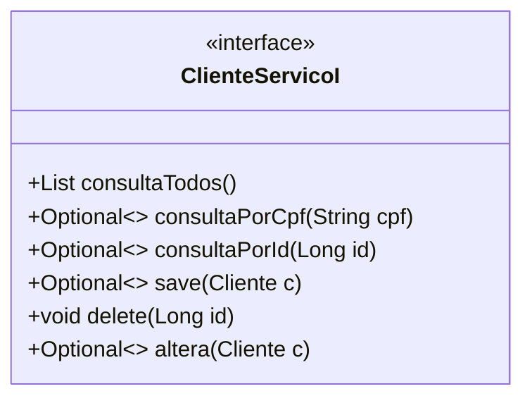
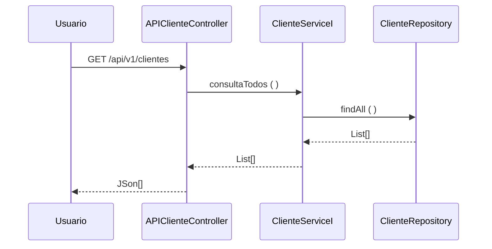

### Fatec ZL - Centro Paula Souza
##### Disciplina - Programação Web III
Grupo SavPets
- André Luiz
- Guilherme Gonçalves
- Gustavo Nascimento
- Mateus Santana
- Pedro Pessina
- Vicenzzo Toth

##### Processo de Desenvolvimento de Software - PDS
> O PDS segue uma abordagem interativa incremental adaptada do Scrum. Cada interação tem uma definição de pronto estabelecida com objetivo de controlar a qualidade.

##### Estudo de Caso – Sistema de Gestão
> A SavPets será uma empresa/organização voluntária, na qual ajudará os animais que forem encontrados e encaminhados para ela. Com esse sistema, será capaz de gerenciar de maneira eficiente e eficaz os dados e departamentos da empresa com o objetivo de tornar o trabalho mais claro e fácil, podendo se concentrar em outros aspectos. O sistema será capaz de permitir maior facilidade durante o gerenciamento e controle do funcionamento da organização, com funções claras e objetivas para todos que são responsáveis por registrar novos cadastros, adoções ou atualizações de registros, e aqueles que necessitam desenvolver relatórios e análises sobre os dados de cada atividade realizada pelos diferentes departamentos existentes. 

##### Product Backlog
- RU01 - Acesso - Controla e informa o acesso do sistema, de forma que integra o register, a alteração da senha e ingressar no sistema
- RU02 - Gerenciar ADM - Registra, informa e controla o gerenciamento da parte adiministrativa do SavPets, contendo register do employee, register de departamentos , cargos existentes e controle de fluxo de acesso no sistema
- RU03 - Relatório - Registra e informa os processos de adoação dos animais, e integra as informações dos dados da data de adoação e categoria do animal 
##### Sprint Backlog
> Cada requisito tem um identificador único de maneira que seja possível rastrear a necessidade do client com a implementação do software.

| Identificador | Descrição | Prioridade |
| ------------ | ------------------------------------------------------------------------ | ------|
| REQ01 – Gerenciar acesso | Como – funcionário, Eu quero – controlar meu acesso ao sistema, De maneira que – seja possível cadastrar-se, alterar a senha e entrar no sistema| Alta |
| REQ02 – Gerenciar cargos | Como – funcionário administrativo, Eu quero – controlar os dados dos cargos, De maneira que – possa atializar os cargos existentes e adiconar novos, além de atribuir uma opção a cada funcionário | Média |
| REQ03 – Gerenciar departamentos | Como – funcionário administrativo, Eu quero – controlar os dados dos departamentos, De maneira que – possa atualizar os departamentos existentes e adicionar novos, além de atribuir uma opção a cada funcionário | Média |
| REQ04 – Gerenciar funcionários | Como – funcionárop administrativo, Eu quero – controlar os dados dos funcionários, De maneira que – possa obter um controle atualizado de cada membro da empresa, podendo inserir novos, atualizar as informações dos existentes ou deletar| Alta |
| REQ05 – Gerenciar clientes | Como – atendente, Eu quero –controlar os dados dos clientes, De maneira que – possa obter um controle atualizado de cada client que realizou alguma adoção, cadastrando, atualizando ou deletando as informações | Alta 
| REQ06 – Gerenciar adoções | Como – atendente, Eu quero – administrar os relatórios de adoções, De maneira que – resulte na organização dos relatórios de cada animal adotado, sendo possível gerar novos registros ou editar os existentes | Alta |
| REQ07 – Gerenciar animais | Como – funcionário da área de controle, Eu quero – administrar os dados dos animais, De maneira que – possa obter um controle atualizado de cada animal que a empresa recebeu, cadastrando, atualizando ou deletando as informações | Alta |
| REQ08 – Gerenciar relatórios de animais | Como – veterinário, Eu quero – administrar os relatórios de animais, De maneira que – resulte na organização dos relatórios de cada animal examinado, sendo possível gerar novos registros, editar ou excluir os existentes | Média | 
| REQ09 – Categorizar animais | Como – funcionário da área de controle, Eu quero –documentar as raças e portes de animais, De maneira que – possa ajudar a incluir detalhes nos registros dos animais que a empresa possui, cadastrando, atualizando ou deletando as diferentes categorias | Baixa 
| REQ010 – Gerenciar medicamentos | Como – funcionário da área de recursos, Eu quero – organizar os dados dos medicamentos, De maneira que – facilite direcionar os registros e controlar o estoque, atraves da inserção, atualização e exclusão dos medicamentos no sistema | Média |
| REQ11 – Gerenciar fornecedores | Como – funcionário administrativo, Eu quero – organizar os dados dos fornecedores, De maneira que – possa obter um controle atualizado de cada provider que a empresa requisitou, cadastrando, atualizando ou deletando as informações| Média |

##### Definição de pronto
> O sprint será considerado concluido quando:
> 1) Os casos de teste de aceitação forem executados e obtiverem satisfação. Os casos de teste (CT) são rastreáveis para os requisitos (REQ). O elo de rastreabilidade é estabelecido pelo identificador do caso de teste.
> 2) Depois que os casos de teste forem executados e obtiverem resultados satisfatórios, as modificações deverão ser enviadas para o github (pull request).
##### Casos de teste
| Identificador | Cenário de uso |
| ------------ | ------------------------------------------------------------------------ |
| REQ01CT01 | Dado (setup) que o CPF do client não está cadastrado; Quando (ação) o usuário confirma o register; Então (resultado esperado) o sistema envia uma mensagem de register realizado com sucesso |
| REQ01CT02 | Dado (setup) que o CPF do client está cadastrado; Quando (ação) o usuário confirma o register; Então (resultado esperado) o sistema rejeita e envia uma mensagem de dados inválidos |
>
O modelo de dominio (Larman, 2006 - classes conceituais ou classes de negócio) foi definido considerando as seguintes classes:

A arquitetura segue uma abordagem orientada a serviços. Os serviços foram classificados em três tipos (ERL, 2007):
- **1. Serviços utilitários**. Implementam funcionalidades comuns a vários tipos de aplicações, como, por exemplo: log, notificação, transformação de informações. Um exemplo de serviço utilitário é um serviço de conversão de moeda que
poderá ser acessado para calcular a conversão de uma moeda (por exemplo, dólares) para outra (por exemplo, euros).
- **2. Serviços de entidade (serviços de negócios)**. Derivado de uma ou mais entidades de negócio (domínio), possuindo um alto grau de reutilização. Geralmente são serviços que fazem operações CRUD (Create, Read, Update e Delete).
- **3. Serviços de tarefa (coordenação de processos-workflow)**. Tipo de serviço mais específico que possui baixo grau de reuso. Consome outros serviços para atender seus consumidores. São serviços que suportam um processo de negócios
amplo que geralmente envolve atividades e atores diferentes. Um exemplo de serviço de coordenação em uma empresa é um serviço de pedidos em que os pedidos são feitos, os produtos são aceitos e os pagamentos são efetuados.
A visão lógica da arquitetura para API de Cliente é apresentada na figura abaixo. A visã lógica descreve como o código está organizado, as classes os pacotes e os relacionamentos entre eles.

>A entidade Cliente foi identificada como um serviço (ERL, 2007 - serviço do tipo entidade) o contrado das operações de sistema (LARMAN, 2006, pag.140) foram definidas no diagrama abaixo.

>O diagrama de sequência descreve como os varios componentes arquiteturais colaboram para manipular uma operação de sistema (exemplo para operação consultaTodos())

>Referencias
- [1] KRUCHTEN, Philippe. Reference: Title: Architectural blueprints—the “4+ 1” view model of software architecture. IEEE software, v. 12, n. 6, 1995.
- [2] RICHARDSON, Chris. Microservices patterns: with examples in Java. Simon and Schuster, 2018.
- [3] ERL, Thomas. SOA principles of service design (the Prentice Hall service-oriented computing series from Thomas Erl). Prentice Hall PTR, 2007.
- [4] LARMAN, Craig. Utilizando UML e padrões. 2aed., Porto Alegre: Bookman Editora, 2006 (pag. 147).
Footer
© 2023 GitHub, Inc.
Footer navigation
Terms
Privacy
Security
Status
Docs
Contact GitHub
Pricing
API
Training
Blog
About
