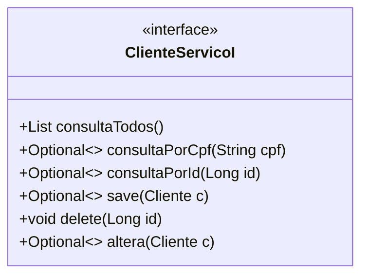
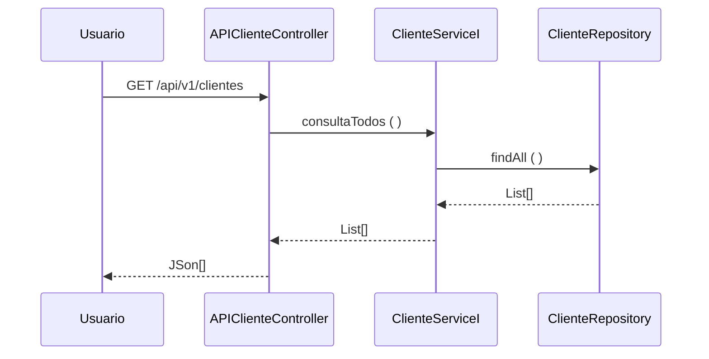

### Fatec ZL - Centro Paula Souza
##### Disciplina - Programação Web III
Grupo SavPets
- André Luiz
- Guilherme Gonçalves
- Gustavo Nascimento
- Mateus Santana
- Pedro Pessina
- Vicenzzo Toth

##### Processo de Desenvolvimento de Software - PDS
> O PDS segue uma abordagem interativa incremental adaptada do Scrum. Cada interação tem uma definição de pronto estabelecida com objetivo de controlar a qualidade.

##### Estudo de Caso – Sistema de Gestão
> A SavPets será uma empresa/organização voluntária, na qual ajudará os animais que forem encontrados e encaminhados para ela. Com esse sistema, será capaz de gerenciar de maneira eficiente e eficaz os dados e departamentos da empresa com o objetivo de tornar o trabalho mais claro e fácil, podendo se concentrar em outros aspectos. O sistema será capaz de permitir maior facilidade durante o gerenciamento e controle do funcionamento da organização, com funções claras e objetivas para todos que são responsáveis por registrar novos cadastros, adoções ou atualizações de registros, e aqueles que necessitam desenvolver relatórios e análises sobre os dados de cada atividade realizada pelos diferentes departamentos existentes. 

##### Product Backlog
- RU01 - Acesso - Controla e informa o acesso do sistema, de forma que integra o register, a alteração da senha e ingressar no sistema
- RU02 - Gerenciar ADM - Registra, informa e controla o gerenciamento da parte adiministrativa do SavPets, contendo register do employee, register de departamentos , cargos existentes e controle de fluxo de acesso no sistema
- RU03 - Relatório - Registra e informa os processos de adoação dos animais, e integra as informações dos dados da data de adoação e categoria do animal 
##### Sprint Backlog
> Cada requisito tem um identificador único de maneira que seja possível rastrear a necessidade do client com a implementação do software.

| Identificador | Tema | Nome | Descrição | Prioridade | Sprint | Status|
| ------------ | --------------|-------|------------------------------------------------------------------------ | ------|---------|------|
| REQ01 |Autenticação | Cadastro| Permitir que o administrador realize o cadastro de novos usuários no sistema. |Alta| 1| Conluido|
| REQ02 | Autenticação | Login | Permitir que o usuário acesse o sistema de gestão, informando seu e-mail e senha cadastrados. |Alta|1|Conluido|
| REQ03 | Autenticação | Sessão de login| Fazer com que o nome do funcionário apareça no painel ao entrar no sistema. |Media|2|Conluido|
| REQ04 | Autenticação | Recuperar senha| Permitir que o usuário recupere a senha de sua conta do sistema. |Alta|1|Conluido|
| REQ05 | Autenticação | Exigência de login | Não permitir o acesso ao sistema pelas URLs sem realizar o login.|Alta|3|Conluido|
| REQ05 | Autenticação | Restrição de acesso | Restringir o acesso do usuário logado de acordo com seu cargo, limitando apenas às opções pertinentes. |Media|4|Conluido|
| REQ06 | Cargo | Gerir cargos | O funcionário mantém os cargos de departamentos, adicionando, atualizando, excluindo e consultando.|Media|2|Conluido|
| REQ07 | Departamento | Administrar departamentos | Permitir que o funcionário faça o gerenciamento, criando, excluindo, consultando e atualizando os departamentos. |Alta|2|Conluido|
| REQ08 |Funcionário | Supervisionar funcionários | O gerente consegue visualizar o histórico de ações dos outros funcionários no sistema. |Alta |1|Conluido|
| REQ09 |Animal | Organizar animais | O funcionário pode organizar os dados dos animais, adicionando, atualizando e lendo. |Media|1|Conluido|
| REQ010 |Animal | Manter relatórios de animais | O funcionário mantém os relatórios de animais que a instituição recebe, adicionando, atualizando e consultando. |Alta|2|Conluido|
| REQ11 |Cliente | Gerenciar clientes| Faz com que o funcionário possa administrar o cliente, atualizando, adicionando, excluindo ou consultando os clientes. |Alta|1|Conluido|
| REQ12 |Adoção | Controlar adoções| Permitir que o funcionário controle as adoções, adicionando, atualizando e consultando os registros. |Media|3|Conluido|
| REQ13 |Fornecedor | Administrar fornecedores | O funcionário pode administrar os fornecedores, criando, excluindo, atualizando e consultando os fornecedores. |Baixa|1|Conluido|
| REQ14 |Medicamento | Controlar medicamentos| Os funcionários conseguem visualizar e manipular os dados de medicamentos. |Baixa|2|Conluido|
| REQ15 |Campanha de adoção | Controlar campanhas de adoção| Permitir que o funcionário faça o gerenciamento, criando, excluindo, consultando e atualizando as campanhas (eventos) de adoção de animais. |Baixa|3|Conluido|
| REQ16 |Modelagem de dados | Diagrama de relação e coleção - CRD | Diagrama contendo a relação entre as coleções que serão usadas no banco de dados não relacional. |Media|4|Conluido|
| REQ17 |Modelagem de dados | Dicionário de dados | Dicionário de dados que estarão no sistema, contendo nome do campo, tipo e descrição. |Media|4|Conluido|
| REQ18 |Modelo de documentos (JSON) | Modelo de documento de funcionários | Apresentar um modelo de documento relacionado a funcionário que será organizado em uma coleção. |Media|4|Conluido|
| REQ19 | Modelo de documentos (JSON) | Modelo de documento de cargos | Desenvolver modelo de documento para cargo e organizar em coleção.   | Media|4|Conluido|
| REQ20 | Modelo de documentos (JSON) | Modelo de documento de departamentos | Criar modelo de documento de departamento que será organizado em uma coleção. |Media|4|Conluido|
| REQ21 | Modelo de documentos (JSON) | Modelo de documento de categoria de animais | Realizar um modelo de documento sobre a categoria de animal para organizar em uma coleção.   |Media|4|Conluido|
| REQ22 | Modelo de documentos (JSON) | Modelo de documento de relatório de animais| Apresentar um modelo de documento relacionado a relatório de animal que será organizado em uma coleção. |Media|4|Conluido|
| REQ23 | Modelo de documentos (JSON) | Modelo de documento de adoções| Realizar um modelo de documento para adoção que será organizado em uma coleção.  |Media|4|Conluido|
| REQ24 | Modelo de documentos (JSON) | Modelo de documento de clientes | Executar a criação de um modelo de documento sobre cliente e organizar em coleção.  |Media|4|Conluido|
| REQ25 | Modelo de documentos (JSON) | Modelo de documento de fornecedores | Desenvolver modelo de documento para fornecedor e organizar em coleção. |Media|4|Conluido|
| REQ26 | Modelo de documentos (JSON) | Modelo de documento de medicamentos| Criar projeto de documento de medicamento e organizar em coleção. |Media|4|Conluido|
| REQ27 | Modelo de documentos (JSON) | Modelo de documento de campanhas | Fazer modelo de documento para campanha que será organizado em coleção. |Baixa|4|Conluido|
| REQ28 | Validação de design | Revisão de design | Revisão de elementos visuais do projeto para padronização |Media|2|Conluido|
| REQ29 | Validação de design | Teste de usabilidade | Teste de funcionabilidade para cliente |Baixa|Aguardando|
| REQ30 | Validação de design | Acessibilidade | Tornar o projeto acessível para qualquer pessoa, incluindo funções de acessibilidade nas páginas do sistema. | Media|4|Em Andamento|
| REQ31 | Validação de design | Revisão de comunicabilidade | Identificação de melhorias e adições de novos elementos para facilitar o uso do sistema. |Media|2|Conluido|
| REQ32 | Validação de design | Revisão de mensagens de erro | Posicionar a mensagem de erro abaixo do campo que não segue a regra inserida. |Baixa|3|Conluido|
| REQ33 | Refatoração | Refatoração nas classes do backend| Refinamento de código nas classes de serviço, modelo e controle do backend. |Baixa|2|Conluido|
| REQ34 | Refatoração | Validação de CEP| Implementação da API ViaCEP para validação de entrada de dados. |Baixa|2|Conluido|
| REQ35 | Refatoração | Adaptação para utilizar DTO | Adicionar novas estruturas para classes de transferências do backend. |Media|3|Conluido|
| REQ36 | Refatoração | Regras para os campos select | Não permitir que o valor padrão do campo select seja aceito ao enviar o formulário. |Media|3|Conluido|
| REQ37 | Teste | Teste de unidade| Processo de validação de funções dos projetos, garantindo o funcionamento. |Media|3|Aguardando|
| REQ38 | Teste | Teste de desempenho| Teste para verificar velocidade de projeto e capacidade de grandes dados. |Media|5|Aguardando|
| REQ39 | Teste | Teste de segurança | Testar o projeto (site), sobre defesa contra invasões, corrigindo vulnerabilidades.  |Alt|5|Aguardando|
| REQ40 | Teste | Teste de funcionamento geral | Processo de testagem do site em seus funcionamentos como usabilidade, acessibilidade etc. |Media|5|Aguardando|
| REQ41 | Hospedagem | Seleção de provedor de hospedagem | Selecionar o provedor onde o projeto será hospedado. |Media |4|Conluido|
| REQ42 | Hospedagem | Implantação do sistema e banco de dados | Processo de implementação de dados do projeto para o banco de dados e do sistema para a rede |Alta|6|Aguardando|
| REQ43 | Documentação | Documentação técnica | Processo de Documentação e finalização de projeto para equipe e cliente. |Alta|6|Aguardando|
| REQ44 | Páginas públicas | Home pública| Adaptação da página home pública do site. |Baixa|3|Conluido|
| REQ45 | Páginas públicas | Página de campanhas| Criação do protótipo e da página pública de campanhas de adoção. |Baixa|4|Em Andamento |

##### Definição de pronto
> O sprint será considerado concluido quando:
> 1) Os casos de teste de aceitação forem executados e obtiverem satisfação. Os casos de teste (CT) são rastreáveis para os requisitos (REQ). O elo de rastreabilidade é estabelecido pelo identificador do caso de teste.
> 2) Depois que os casos de teste forem executados e obtiverem resultados satisfatórios, as modificações deverão ser enviadas para o github (pull request).
##### Casos de teste
| Identificador | Cenário de uso |
| ------------ | ------------------------------------------------------------------------ |
| REQ01CT01 | Dado (setup) que o CPF do client não está cadastrado; Quando (ação) o usuário confirma o register; Então (resultado esperado) o sistema envia uma mensagem de register realizado com sucesso |
| REQ01CT02 | Dado (setup) que o CPF do client está cadastrado; Quando (ação) o usuário confirma o register; Então (resultado esperado) o sistema rejeita e envia uma mensagem de dados inválidos |
>
O modelo de dominio (Larman, 2006 - classes conceituais ou classes de negócio) foi definido considerando as seguintes classes:

A arquitetura segue uma abordagem orientada a serviços. Os serviços foram classificados em três tipos (ERL, 2007):
- **1. Serviços utilitários**. Implementam funcionalidades comuns a vários tipos de aplicações, como, por exemplo: log, notificação, transformação de informações. Um exemplo de serviço utilitário é um serviço de conversão de moeda que
poderá ser acessado para calcular a conversão de uma moeda (por exemplo, dólares) para outra (por exemplo, euros).
- **2. Serviços de entidade (serviços de negócios)**. Derivado de uma ou mais entidades de negócio (domínio), possuindo um alto grau de reutilização. Geralmente são serviços que fazem operações CRUD (Create, Read, Update e Delete).
- **3. Serviços de tarefa (coordenação de processos-workflow)**. Tipo de serviço mais específico que possui baixo grau de reuso. Consome outros serviços para atender seus consumidores. São serviços que suportam um processo de negócios
amplo que geralmente envolve atividades e atores diferentes. Um exemplo de serviço de coordenação em uma empresa é um serviço de pedidos em que os pedidos são feitos, os produtos são aceitos e os pagamentos são efetuados.
A visão lógica da arquitetura para API de Cliente é apresentada na figura abaixo. A visã lógica descreve como o código está organizado, as classes os pacotes e os relacionamentos entre eles.

>A entidade Cliente foi identificada como um serviço (ERL, 2007 - serviço do tipo entidade) o contrado das operações de sistema (LARMAN, 2006, pag.140) foram definidas no diagrama abaixo.

>O diagrama de sequência descreve como os varios componentes arquiteturais colaboram para manipular uma operação de sistema (exemplo para operação consultaTodos())

>Referencias
- [1] KRUCHTEN, Philippe. Reference: Title: Architectural blueprints—the “4+ 1” view model of software architecture. IEEE software, v. 12, n. 6, 1995.
- [2] RICHARDSON, Chris. Microservices patterns: with examples in Java. Simon and Schuster, 2018.
- [3] ERL, Thomas. SOA principles of service design (the Prentice Hall service-oriented computing series from Thomas Erl). Prentice Hall PTR, 2007.
- [4] LARMAN, Craig. Utilizando UML e padrões. 2aed., Porto Alegre: Bookman Editora, 2006 (pag. 147).
Footer
© 2023 GitHub, Inc.
Footer navigation
Terms
Privacy
Security
Status
Docs
Contact GitHub
Pricing
API
Training
Blog
About
