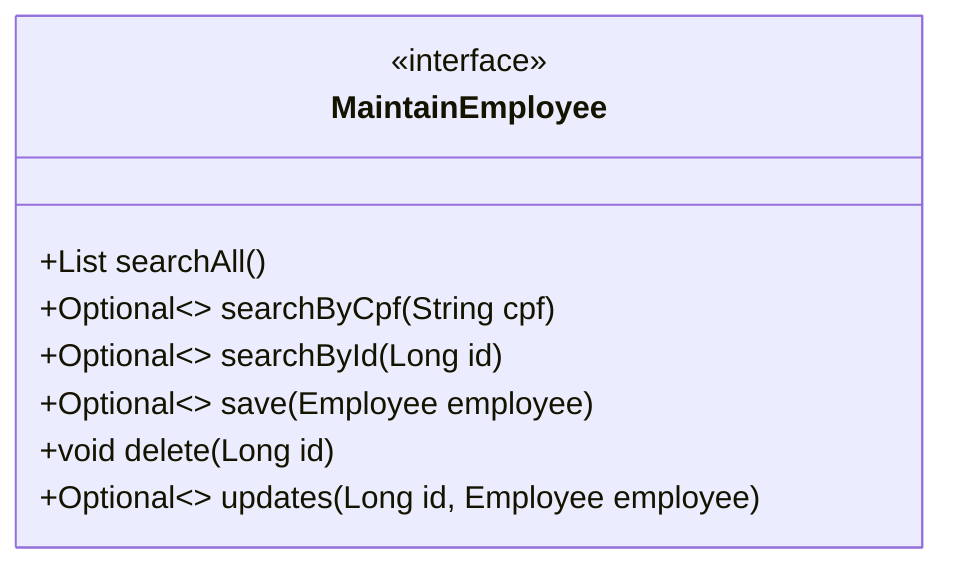
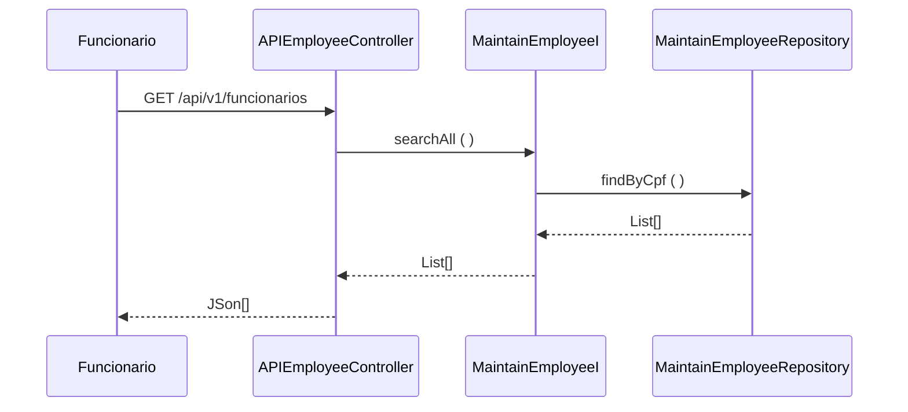

### Fatec ZL - Centro Paula Souza
##### Disciplina - Programação Web III
Grupo SavPets
- André Luiz
- Guilherme Gonçalves
- Gustavo Nascimento
- Mateus Santana
- Pedro Pessina
- Vicenzzo Toth

##### Processo de Desenvolvimento de Software - PDS
> O PDS segue uma abordagem interativa incremental adaptada do Scrum. Cada interação tem uma definição de pronto estabelecida com objetivo de controlar a qualidade.

##### Estudo de Caso – Sistema de Gestão
> A SavPets será uma empresa/organização voluntária, na qual ajudará os animais que forem encontrados e encaminhados para ela. Com esse sistema, será capaz de gerenciar de maneira eficiente e eficaz os dados e departamentos da empresa com o objetivo de tornar o trabalho mais claro e fácil, podendo se concentrar em outros aspectos. O sistema será capaz de permitir maior facilidade durante o gerenciamento e controle do funcionamento da organização, com funções claras e objetivas para todos que são responsáveis por registrar novos cadastros, adoções ou atualizações de registros, e aqueles que necessitam desenvolver relatórios e análises sobre os dados de cada atividade realizada pelos diferentes departamentos existentes. 

##### Product Backlog
| Requisito |Temas| Descrição |
|-------- | ---------|------------------------------------------------------------------------------------------ |
|REQ01| Autenticação|-Cadastro-Permitir que o administrador realize o cadastro de novos usuários no sistema. |
|REQ02| Autenticação|-Login -Permitir que o usuário acesse o sistema de gestão, informando seu e-mail e senha cadastrados. |
|REQ03 | Autenticação|-Sessão de login- Fazer com que o nome do funcionário apareça no painel ao entrar no sistema. |
| REQ04 | Autenticação|-Recuperar senha- Permitir que o usuário recupere a senha de sua conta do sistema.|
| REQ05 | Autenticação|-Exigência de login-  Não permitir o acesso ao sistema pelas URLs sem realizar o login.|
| REQ05 | Autenticação|-Restrição de acesso-  Restringir o acesso do usuário logado de acordo com seu cargo, limitando apenas às opções pertinentes. |
| REQ06 | Cargo  |-Gerir cargos-O funcionário mantém os cargos de departamentos, adicionando, atualizando, excluindo e consultando.|
| REQ07 | Departamento-Administrar departamentos|-  Permitir que o funcionário faça o gerenciamento, criando, excluindo, consultando e atualizando os departamentos. |
| REQ08 | Funcionário |-Supervisionar funcionários -O gerente consegue visualizar o histórico de ações dos outros funcionários no sistema.|
| REQ09 | Animal  |-Organizar animais -O funcionário pode organizar os dados dos animais, adicionando, atualizando e lendo. |
| REQ010 | Animal |- Manter relatórios de animais - O funcionário mantém os relatórios de animais que a instituição recebe, adicionando, atualizando e consultando.|
| REQ11 | Cliente |- Gerenciar clientes- Faz com que o funcionário possa administrar o cliente, atualizando, adicionando, excluindo ou consultando os clientes.| 
| REQ12 |Adoção |- Controlar adoções- Permitir que o funcionário controle as adoções, adicionando, atualizando e consultando os registros.|
| REQ13 |Fornecedor |- Administrar fornecedores - O funcionário pode administrar os fornecedores, criando, excluindo, atualizando e consultando os fornecedores.| 
| REQ14 |Medicamento |- Controlar medicamentos- Os funcionários conseguem visualizar e manipular os dados de medicamentos.|
| REQ15 |Campanha de adoção |- Controlar campanhas de adoção- Permitir que o funcionário faça o gerenciamento, criando, excluindo, consultando e atualizando as campanhas (eventos) de adoção de animais.| 
| REQ16 |Modelagem de dados |- Diagrama de relação e coleção - CRD - Diagrama contendo a relação entre as coleções que serão usadas no banco de dados não relacional.| 
| REQ17 |Modelagem de dados - Dicionário de dados |- Dicionário de dados que estarão no sistema, contendo nome do campo, tipo e descrição. |
| REQ18 |Modelo de documentos (JSON) |- Modelo de documento de funcionários - Apresentar um modelo de documento relacionado a funcionário que será organizado em uma coleção.|
| REQ19  |Modelo de documentos (JSON) |- Modelo de documento de cargos - Desenvolver modelo de documento para cargo e organizar em coleção.   |
| REQ20  |Modelo de documentos (JSON) |- Modelo de documento de departamentos - Criar modelo de documento de departamento que será organizado em uma coleção. |
| REQ21  |Modelo de documentos (JSON) |- Modelo de documento de categoria de animais - Realizar um modelo de documento sobre a categoria de animal para organizar em uma coleção.   |
| REQ22  |Modelo de documentos (JSON) |- Modelo de documento de relatório de animais- Apresentar um modelo de documento relacionado a relatório de animal que será organizado em uma coleção.| 
| REQ23  |Modelo de documentos (JSON) |- Modelo de documento de adoções- Realizar um modelo de documento para adoção que será organizado em uma coleção. | 
| REQ24  |Modelo de documentos (JSON) |- Modelo de documento de clientes - Executar a criação de um modelo de documento sobre cliente e organizar em coleção.| 
| REQ25  |Modelo de documentos (JSON) |- Modelo de documento de fornecedores - Desenvolver modelo de documento para fornecedor e organizar em coleção.|
| REQ26  |Modelo de documentos (JSON) |- Modelo de documento de medicamentos- Criar projeto de documento de medicamento e organizar em coleção.|
| REQ27  |Modelo de documentos (JSON) |- Modelo de documento de campanhas - Fazer modelo de documento para campanha que será organizado em coleção. |
| REQ28  |Validação de design |- Revisão de design - Revisão de elementos visuais do projeto para padronização| 
| REQ29  |Validação de design |- Teste de usabilidade - Teste de funcionabilidade para cliente |
| REQ30  |Validação de design |- Acessibilidade - Tornar o projeto acessível para qualquer pessoa, incluindo funções de acessibilidade nas páginas do sistema.| 
| REQ31  |Validação de design |- Revisão de comunicabilidade - Identificação de melhorias e adições de novos elementos para facilitar o uso do sistema.| 
| REQ32  |Validação de design| - Revisão de mensagens de erro - Posicionar a mensagem de erro abaixo do campo que não segue a regra inserida.| 
| REQ33  |Refatoração |- Refatoração nas classes do backend- Refinamento de código nas classes de serviço, modelo e controle do backend.|
| REQ34  |Refatoração |- Validação de CEP- Implementação da API ViaCEP para validação de entrada de dados. |
| REQ35  |Refatoração |- Adaptação para utilizar DTO - Adicionar novas estruturas para classes de transferências do backend. |
| REQ36  |Refatoração| - Regras para os campos select - Não permitir que o valor padrão do campo select seja aceito ao enviar o formulário. |
| REQ37  |Teste |- Teste de unidade- Processo de validação de funções dos projetos, garantindo o funcionamento. |
| REQ38  |Teste |- Teste de desempenho- Teste para verificar velocidade de projeto e capacidade de grandes dados. |
| REQ39  |Teste |- Teste de segurança - Testar o projeto (site), sobre defesa contra invasões, corrigindo vulnerabilidades.  |
| REQ40  |Teste |- Teste de funcionamento geral - Processo de testagem do site em seus funcionamentos como usabilidade, acessibilidade etc.| 
| REQ41  |Hospedagem |- Seleção de provedor de hospedagem - Selecionar o provedor onde o projeto será hospedado. |
| REQ42  |Hospedagem |- Implantação do sistema e banco de dados - Processo de implementação de dados do projeto para o banco de dados e do sistema para a rede|
| REQ43  |Documentação| - Documentação técnica - Processo de Documentação e finalização de projeto para equipe e cliente.| 
| REQ44  |Páginas públicas |- Home pública- Adaptação da página home pública do site. |
| REQ45  |Páginas públicas| -Página de campanhas- Criação do protótipo e da página pública de campanhas de adoção.|

##### Definição de pronto
> O sprint será considerado concluido quando:
> 1) Os casos de teste de aceitação forem executados e obtiverem satisfação. Os casos de teste (CT) são rastreáveis para os requisitos (REQ). O elo de rastreabilidade é estabelecido pelo identificador do caso de teste.
> 2) Revisar o projeto pela ferramenta Sonar
> 3) Depois que os casos de teste forem executados e obtiverem resultados satisfatórios, as modificações deverão ser enviadas para o github (pull request).

##### Casos de teste

| Identificador | Cenário de uso |
| ------------ | ------------------------------------------------------------------------ |
| REQ01CT01 | Dado (setup) que o email do usuario não está cadastrado; Quando (ação) o usuário confirma o register; Então (resultado esperado) o sistema envia uma mensagem de register realizado com sucesso |
| REQ01CT02 | Dado (setup) que o email do usuario está cadastrado; Quando (ação) o usuário confirma o register; Então (resultado esperado) o sistema rejeita e envia uma mensagem de dados inválidos |
| REQ02CT01 | Dado (setup) que os dados de Fornecedor não esta cadastrado; Quando (ação) o funcionario confirma o registro; Então(resultado esperado) o sistema envia uma mensagem de registro realizado com sucesso|
| REQ02CT02 | Dado (setup) que os dados de Fornecedor esta cadastrado; Quando (ação) o funcionario confirma o registro; Então(resultado esperado) o sistema rejeita e envia uma mensagem de dados invalidos|
| REQ03CT01 | Dado (setup) que os dados de Medicamento não esta cadastrado; Quando (ação) o funcionario confirma o registro; Então(resultado esperado) o sistema envia uma mensagem de registro realizado com sucesso|
| REQ03CT02 | Dado (setup) que os dados de Medicamento esta cadastrado; Quando (ação) o funcionario confirma o registro; Então(resultado esperado) o sistema rejeita e envia uma mensagem de dados invalidos|

>
O modelo de dominio (Larman, 2006 - classes conceituais ou classes de negócio) foi definido considerando as seguintes classes:

### Tecnologias Usadas

|Tecnologias| Descrição|
|------|---------------|
|SpringBoot|Spring Boot é uma ferramenta que nasceu a partir do Spring, um framework desenvolvido para a plataforma Java baseado nos padrões de projetos, inversão de controle e injeção de dependência.|
|Thymeleaf|O Thymeleaf é um mecanismo de modelo Java XML/XHTML/HTML5 que pode funcionar em ambientes da Web e não Web. Ele é mais adequado para servir XHTML/HTML5 na camada de visualização de aplicativos da Web baseados em MVC|
|JustValidation.Js| Biblioteca de Validação de campos|
|ApexChart.Js| Biblioteca Open-Source de graficos para registro de dados|
|MongoDB|MongoDB é um software de banco de dados orientado a documentos livre, de código aberto e multiplataforma .Classificado como um programa de banco de dados NoSQL, o MongoDB usa documentos semelhantes a JSON com esquemas|
|dataTables| Biblioteca para a criação de tabelas |
|SweetAlert2| Bibliotecas de alertas de aviso|

>A entidade Cliente foi identificada como um serviço (ERL, 2007 - serviço do tipo entidade) o contrado das operações de sistema (LARMAN, 2006, pag.140) foram definidas no diagrama abaixo.

>O diagrama de sequência descreve como os varios componentes arquiteturais colaboram para manipular uma operação de sistema (exemplo para operação consultaTodos())

>Referencias
- [1] KRUCHTEN, Philippe. Reference: Title: Architectural blueprints—the “4+ 1” view model of software architecture. IEEE software, v. 12, n. 6, 1995.
- [2] RICHARDSON, Chris. Microservices patterns: with examples in Java. Simon and Schuster, 2018.
- [3] ERL, Thomas. SOA principles of service design (the Prentice Hall service-oriented computing series from Thomas Erl). Prentice Hall PTR, 2007.
- [4] LARMAN, Craig. Utilizando UML e padrões. 2aed., Porto Alegre: Bookman Editora, 2006 (pag. 147).
Footer
© 2023 GitHub, Inc.
Footer navigation
Terms
Privacy
Security
Status
Docs
Contact GitHub
Pricing
API
Training
Blog
About
